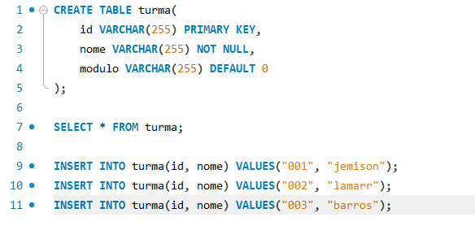
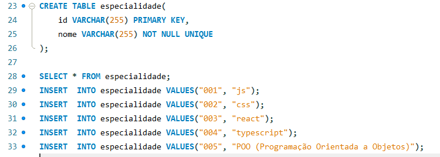
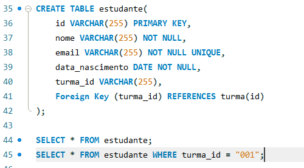
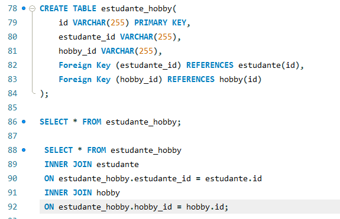

[Link da documentação da API](https://documenter.getpostman.com/view/22349146/2s8ZDU4Nzp)

[Link do deploy](https://labenu-system3.onrender.com)

Você estuda na Labenu_ há tanto tempo que já parecem anos, não é? Então, hoje, vamos pedir para criar um sistema que represente o básico da nossa organização. 

Ele deve possuir, ao menos, as 3 entidades importantes:

1. Estudantes 

    Representa estudantes da nossa instituição. Eles devem possuir: id, nome, email, data de nascimento e os principais hobbies dele. 

2. Docente

    Representa docentes da nossa instituição. Eles devem possuir: id, nome, email, data de nascimento e todas as especialidades dele. Há 7 especialidades: React, Redux, CSS, Testes, Typescript, Programação Orientada a Objetos e Backend

3. Turma

    Toda turma é composta das seguintes características: id, nome, data de início, data de término, lista de professores responsáveis, uma lista de alunos e módulo atual em que a turma está.

    O módulo pode assumir os valores de 1 a 7 ou `undefined`, indicando que as aulas dessa turma ainda não começaram. Para esse exercício, vamos considerar que existam dois tipos de turma: integral ou noturna. Há uma restrição para o nome das turmas noturnas: tem que terminar com `-na-night`.

As funcionalidades básicas são:

→ Criar estudante;

→ Criar docente;

→ Criar turma;

→ Adicionar estudante na turma;

→ Adicionar docente na turma;

→ Pegar a idade de algum estudante a partir do id
